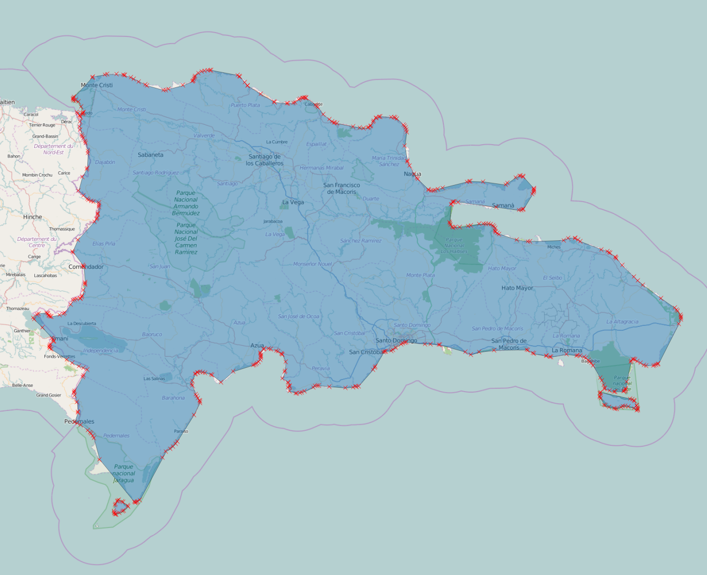
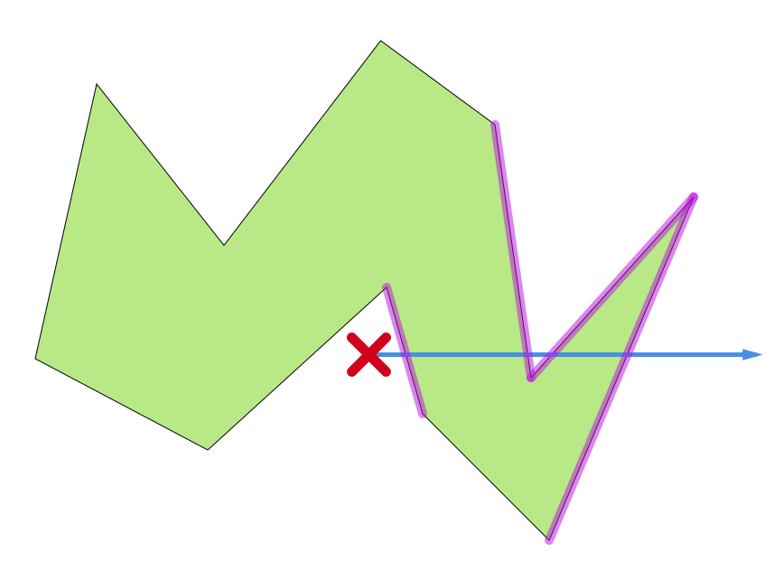
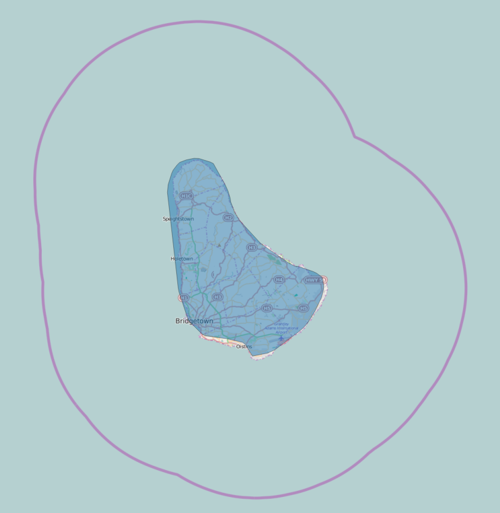

---
title: Fast, Offline, Reverse Geocoding; or, in Which Polygon am I?
description: An algorithm for finding out which country contains a (lat,long) pair
tags: algorithms, programming
...

*Geocoding* is the process of going from a description of a place, such as a place name or a postal address to geographic coordinates. It should not be surprising, then, that *reverse* geocoding is the process of going in the other direction: from coordinates to a place name.

In my iOS/watchOS app [*How Much?*](http://gethowmuch.com/) being able to do offline, reverse geocoding is 90% of its value proposition. It is a currency converter that knows the currency of the region you're currently in and can convert prices to your "home currency". Figuring out the latter is easy: just consult the device's region settings. But the moment you want to find out which country a device is in, you need to use something like [CLGeocoder](https://developer.apple.com/library/ios/documentation/CoreLocation/Reference/CLGeocoder_class/index.html) from the iOS SDK which in turn means that you need a WiFi/data connection.

A currency converter is only really useful when travelling, and when you are in another country---especially just having arrived---you often *don't* have mobile data, so requiring this is not an option. Instead, the app needs to embed geo-data so the reverse geocoding can be done offline using the $(latitude,longitude)$ pair we're able to get from the GPS without a data connection.

Given only a user's position, we then need to figure out the currency that is used at that location. This almost always corresponds to finding out which country the user is in, so we will need data about country borders. There are several good sources for map data, such as  [thematicmapping.org](http://thematicmapping.org/downloads/world_borders.php), [Mapzen](https://mapzen.com/data/borders/) and [OpenStreetMap](http://www.openstreetmap.org/), but which dataset should we use? Ideally borders should be accurate *and* detailed so people will get the "wow" feeling of walking across the border from Spain to Gibraltar and see the app change from Euro to Pounds, but at the same time the reverse geocoding process also needs to be fast since the app should be able to figure out the currency near-instantaneously even when it is first launched. Since we want to both have detailed maps^[To some extent, that is. After all, [how Long Is the Coast of Britain?](https://en.wikipedia.org/wiki/How_Long_Is_the_Coast_of_Britain%3F_Statistical_Self-Similarity_and_Fractional_Dimension)] and provide a good (i.e. fast) user experience it is quite obvious that the algorithm to check which country contains a given $(latitude,longitude)$ pair must be fast.

# Where am I?

A country is in geo-data terms simply a set of one or more polygons representing that country's borders:



We can then specify the problem we need to solve: **given a coordinate and a list of polygons, which---if any---of the polygons contains this position?**

We can do some simple tricks such as calculating bounding boxes for countries and its sub-polygons in order to quickly filter out non-candidate polygons, but in the end we will most often have to actually check whether one or more polygons actually contain some given point. The good news is that there *is* a fast way to do this. The key observation is that an imagined ray---in any direction---from the given point will cross an odd number of edges if, and only if, the point is contained within the polygon. For a convex polygon this number will be one, but for concave polygons it could be higher since the ray might cross one or more "notches" in the polygon:



Armed with this insight, the high-level algorithm is quite simple: loop over each edge (i.e. pair of points) of the polygon and check if it crosses our imagined ray. If the count of these crossings is an odd number, the point is inside the polygon. This means that testing for containment in a polygon is linear in the number of points. This turns out to be more than fast enough even with quite detailed map and even on an Apple Watch.

The following C code is only slightly modified from the code on [W. Randolph Franklin's page on *PNPOLY*](http://www.ecse.rpi.edu/Homepages/wrf/Research/Short_Notes/pnpoly.html). The first test in the `if` statement makes sure that the edge we're considering is not above or below the ray (i.e. that not both $y$ values of the edge's two points are above or both below the ray), while the second test checks that our point is to the left of the edge.^[I.e. in the half-plane to the left of the extended edge---looking from the point whose $y$ value is lowest.] This code uses a technique called [*Simulation of Simplicity*](http://citeseer.ist.psu.edu/viewdoc/summary?doi=10.1.1.38.5997) to deal with edge cases such as the ray going through a point. For our use case this is not strictly needed since the probability of this happening in real life is negligible and self-correcting.

```cpp
bool pnpoly(int nvert, float xverts[], float yverts[], float testx, float testy)
{
  bool is_inside = false;

  for (int i = 0, int j = nvert-1; i < nvert; j = i++) {
    if (((yverts[i]>testy) != (yverts[j]>testy))
         && (testx < (xverts[j]-xverts[i])
           * (testy-yverts[i]) / (yverts[j]-yverts[i])
           + xverts[i])) {
       is_inside = !is_inside;
    }
  }
  return is_inside;
}
```

## Improvements and Optimizations

In practice we want to use a country's *administrative* border(s) instead of the physical border(s). While a physical border will try to follow a coastline, the administrative border will extend 200 nautical miles from the coast^[The actual details are complicated: <https://en.wikipedia.org/wiki/Maritime_boundary>] and thus be less jagged. This makes the polygons simpler but also ensures that people on the beach at low tide aren't suddenly in no-mans-land:



Even when using administrative borders, coasts can usually be simplified even further---often down to just a few points, so an island such as Malta shown above can be simplified to a polygon of 4--5 points.

Another safeguard against small inaccuracies in the map data is to do another pass when a user's position isn't contained in any of the polygons. In this second pass we'll look for points in the polygons that are within some delta (e.g. 10 km) from the position and then guess that the user is in the country whose polygon that point belongs to.

## Testing

Finally, to sleep well at night and not having to think of all the [weird country borders](https://www.flickr.com/photos/amapple/sets/72157616310862857/), enclaves and exclaves that exist, a test suite that will be run on map or code updates is needed. This will look something like the snippet below

```swift
private let knownLocations = [
    // Timor
    ("ID", (-9.076393, 125.110543)),
    ("TL", (-9.358113, 124.218529)),
    ("TL", (-8.547841, 125.563148)),

    // Kaliningrad Oblast, Russia
    ("RU", (54.805974, 22.832453)),

    // Borneo
    ("BN", (4.691033, 115.049274)),
    ("BN", (4.889546, 114.955767)),
    ("MY", (4.209058, 117.748969)),
    ("ID", (4.153036, 117.773551)),
    ("MY", (4.833470, 115.011051)),

    // …
]

func testReverseGeocoding() {
    for (country, (lat,long)) in knownLocations {
        let result = countryForLocation(latitude: lat, longitude: long)
        XCTAssert(result?.code == country,
            "Got \(result?.code) for \((lat, long)). Expected \(country)")
    }
}
```

