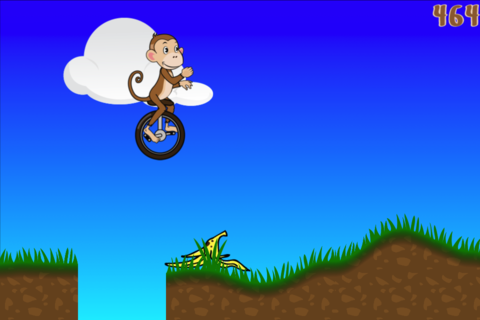

# Projects

Here are some of the projects I work on. A more comprehensive list is available
on my [github accout](https://github.com/ehamberg/).

## Circus Escape

A simple iPhone platform game where the aim is to get as far as possible on a
unicycle while avoiding obstacles.

## vim-cute-python

A python syntax file for Vim that uses the new "conceal" feature in Vim 7.3 to
display unicode characters for some Python operators and built-in functions,
turning the following:

~~~{.python}
    map (lambda x: x, [1,2,3])

    def foo(e, a):
        if e in [1,2,3] and not a:
            return math.sqrt(math.pi)
        else:
            return sum([1,2,3])
~~~

into

~~~{.python}
    map (λ x: x, [1,2,3])

    def foo(e, a):
        if e ∈ [1,2,3] ∧ ¬a:
            return √(π)
        else:
            return ∑([1,2,3])
~~~

- [Code](https://github.com/ehamberg/vim-cute-python)

## SimpleEA

A simple framework for writing evolutionary algorithms in Haskell.

- [Code](https://github.com/ehamberg/simpleea)
- [Documentation](http://hackage.haskell.org/package/SimpleEA)

## GTD Guide: GTD in 15 minutes

A pragmatic guide to the "Getting Things Done" framework. Written in Markdown.

- [GTD in 15 Minutes](http://hamberg.no/gtd)
- [Code](https://github.com/ehamberg/gtdguide)

## Vi input mode for the Kate editor

A vim-like, modal input mode for the Kate editor part used in the [Kate
editor](http://kate-editor.org/), [Kdevelop](http://kdevelop.org), the [Kile
LaTeX editor](http://kile.sourceforge.net/) and various other programs.

This started as a [Google Summer of Code](http://code.google.com/soc/) project
in 2008 and I have maintained it since. I mentored Svyatoslav Kuzmich that
worked on the project as a GSoC student in 2011 and am mentoring Vegard Øye this
summer (2012).

- [The Kate editor](http://kate-editor.org/)
- [Various blog posts about my work on Kate](/tags/kate.html)
